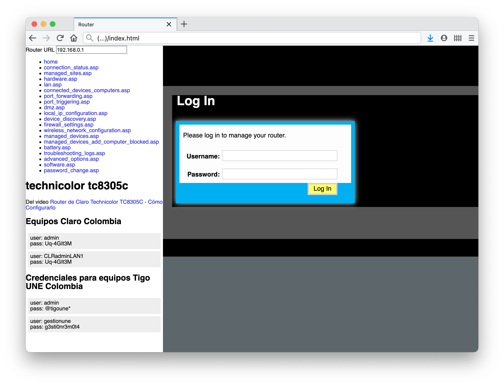

# router_manager

Este es un pequeño index.html hecho para manejar el router Technicolor tc8305c. El archivo está basado en el video [Router de Claro Technicolor TC8305C - Cómo Configurarlo](https://www.youtube.com/watch?v=48OqoDHRwlU). También agregué un par de URL obtenidas de [
sposmen/Claro Tecnicolor TC8305C.md
](https://gist.github.com/sposmen/51c6c6f822980bdf838c2de5dc2bfbbb)

## Para usar

- Opción 1: Clonar repositorio y abrir index.html .
- Opción 2: Solo descargar index.html y abrir.
